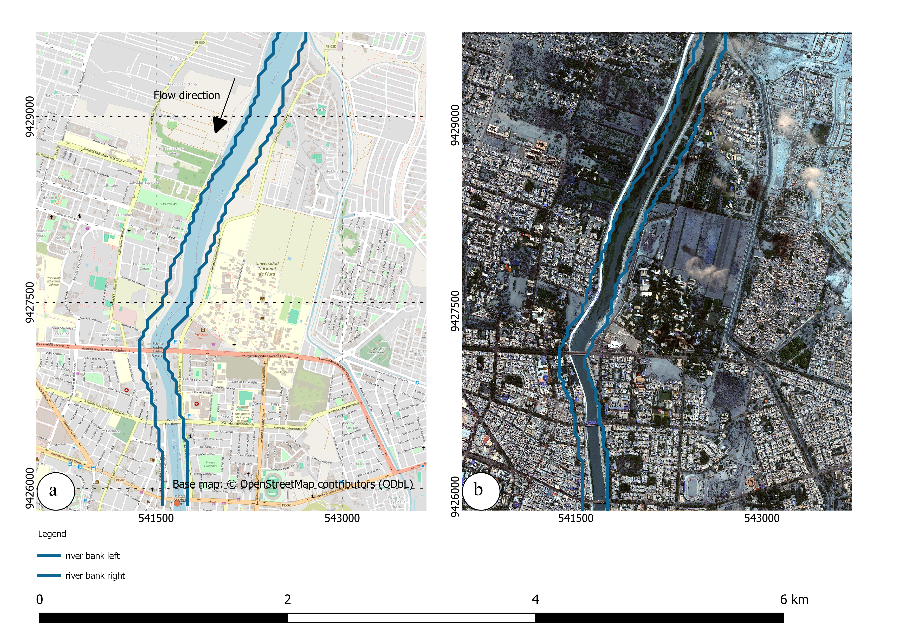
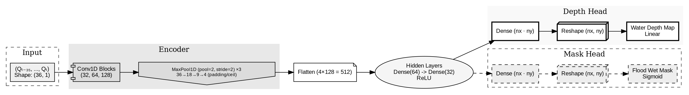
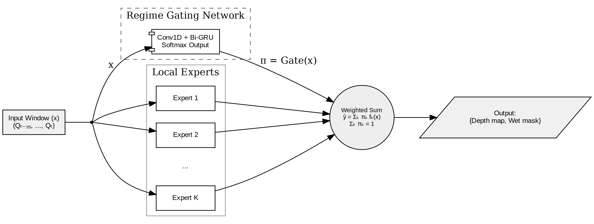

# HydroMoE-Surrogate

**Regime-Dependent Surrogate Modeling for Flood Hydrodynamics**  
*A Conditional Mixture-of-Experts Framework with Learned Gating and Physics-Informed Regularization*

---

## Overview

This repository contains the official implementation of the research study:

> **Structural investigation of regime-dependent surrogate representations under controlled hydrodynamic conditions: A Mixture-of-Experts approach**  
> Zevallos et al., *Environmental Modelling & Software* (Submitted)

Hydrodynamic flood processes exhibit **regime-dependent, non-smooth behavior**, particularly during:

- Wetting–drying transitions  
- Floodplain activation  
- Peak flow propagation  
- Channel-to-overbank switching  

Traditional monolithic neural networks assume a continuous discharge–inundation mapping, which often leads to:

- Smoothing of hydraulic discontinuities  
- Topological instability in inundation fronts  
- Poor regime generalization  

This project introduces a **conditional Mixture-of-Experts (MoE) surrogate** that:

- Learns regime partitions via a gating network  
- Specializes subnetworks for disjoint hydraulic behaviors  
- Enforces physical consistency through mass-balance regularization  

The framework is evaluated under **scenario-disjoint generalization**, meaning test hydrographs are entirely unseen during training.

---

## Computational Domain

The controlled experiments use a representative high-dimensional geometry of the **Lower Piura River Basin (Peru)**.

<p align="center">
  
</p>

*Figure 1. Computational domain used for controlled hydrodynamic experiments. The geometry includes the main channel, urban center, and floodplain connectivity zones.*

This domain provides sufficient topographic complexity to test regime-aware surrogate behavior.

---

## Baseline Surrogate Architecture

The baseline model maps a **36-sample discharge window** to:

- Continuous 2D water depth field  
- Binary inundation (wet/dry) mask  

<p align="center">
  
</p>

*Figure 2. Baseline single-expert CNN surrogate.*

### Architecture Summary

- **Input**: Sliding window \( Q_{t-35,...,t} \) (shape: 36 × 1)
- **Encoder**:
  - 3 Conv1D blocks (32 → 64 → 128 filters)
  - MaxPooling reduces temporal dimension 36 → 4
- **Latent Representation**: 512-dimensional vector
- **Dual Heads**:
  - Depth Head → Linear activation
  - Mask Head → Sigmoid activation

This expert architecture is reused as the building block of the MoE framework.

---

## Proposed Mixture-of-Experts (MoE)

To address discontinuities in flood dynamics, we introduce a **regime-aware MoE architecture**.

<p align="center">
  
</p>

*Figure 3. Proposed Mixture-of-Experts surrogate with learned regime gating.*

### Core Components

### 1️⃣ Regime Gating Network

- Conv1D + Bidirectional GRU backbone  
- Encodes temporal discharge sequence  
- Outputs mixing weights:

$$
\pi = \text{Gate}(x), \quad \sum_{k=1}^{K} \pi_k = 1
$$

The gate dynamically partitions discharge regimes (rising limb, peak, recession).

---

### 2️⃣ Local Experts (K subnetworks)

Each expert:

- Shares the baseline CNN architecture  
- Specializes in a hydrodynamic sub-regime  

---

### 3️⃣ Mixture Output

Final prediction:

$$
\hat{y} = \sum_{k=1}^{K} \pi_k f_k(x)
$$

This conditional blending allows:

- Discontinuous internal representations  
- Reduced cross-regime interpolation error  
- Improved peak synchronization  

---

## Physics-Informed Regularization (PINN Expert)

To prevent physically inconsistent predictions, we embed an **integral mass conservation constraint** into the loss function.

### Total Loss

* **$\mathcal{L}_{depth}$**: Mean Absolute Error of the water depth field.
* **$\mathcal{L}_{mask}$**: Binary Cross-Entropy for the inundation footprint.
* **$\lambda_{phys}\mathcal{L}_{phys}$**: Physics-informed penalty term (PINN) that enforces mass conservation.

### Volume Computation & Physical Consistency

Physical consistency is enforced by comparing the change in predicted stored volume $\hat{V}_t$ against the net flux provided by the input hydrograph, following the volume-consistency regularization approach of Donnelly et al. (2024):

$$
\hat{V}_t = \sum_{j=1}^{N} \hat{h}_{t,j} \Delta x \Delta y
$$

The physics loss $\mathcal{L}_{\text{phys}}$ utilizes rectified residuals (ReLU-based) to ensure the predicted volume remains consistent with the cumulative inflow $Q$ and neighboring time-step volumes $V_{t-1}$ and $V_{t+1}$. By normalizing the volume residual by the total domain area $A$, the loss is expressed as:

$$
\mathcal{L}_{\text{phys}} = \left( \frac{\max(0, \hat{V}_t - V_{t-1} - \Delta t Q_t)}{A} \right)^2 + \left( \frac{\max(0, V_{t+1} - \hat{V}_t - \Delta t Q_{t+1})}{A} \right)^2
$$

This constraint acts as a regularizer, guiding the experts toward hydrologically plausible spatial distributions even when training data is sparse or noisy. This results in:
* **Reduced artificial volume drift** * **Improved mass residuals**
* **Hydrologically plausible flood evolution**

## Experimental Design

### Hydrodynamic Dataset

- 43 synthetic 2D TELEMAC-2D simulations  
- 24-hour hydrographs  
- 5-minute temporal resolution  
- Manning coefficient fixed (n = 0.03)  
- Variable CFL-controlled timestep  

### Scenario-Disjoint Split

| Split | Hydrographs |
|--------|-------------|
| Train  | 32 |
| Val    | 5  |
| Test   | 6  |

Test hydrographs are entirely unseen.

---

## Evaluation Metrics

The surrogate is evaluated using:

- **MAE** (depth accuracy)
- **CSI** (Critical Success Index for inundation extent)
- **Relative Volume Error**
- **Mass Residual**

This multi-component evaluation ensures:

- Spatial topology accuracy  
- Continuous depth fidelity  
- Physical consistency  

---

## Ablation Study

Six configurations were tested:

| ID | Experts | Mask | Physics | Description |
|----|---------|------|---------|------------|
| M1 | 1 | ❌ | ❌ | Single-depth baseline |
| M2 | 4 | ❌ | ❌ | MoE-depth |
| M3 | 1 | ✅ | ❌ | Single + mask |
| M4 | 4 | ✅ | ❌ | MoE + mask |
| M5 | 1 | ❌ | ✅ | Single + physics |
| M6 | 4 | ✅ | ✅ | **Full PINN-MoE** |

Key finding:

- Conditional gating alone does not resolve topological errors.
- Physics regularization alone does not recover inundation geometry.
- Only the full MoE + Mask + Physics model achieves simultaneous improvement in:
  - CSI  
  - Depth loss  
  - Mass consistency  

---

---

## Installation

### Requirements

- Python 3.9+
- TensorFlow / Keras
- NumPy
- Pandas
- Matplotlib
- Rasterio

Install dependencies:

```bash
pip install -r requirements.txt
```

## Key Contributions

✔ Demonstrates structural failure of monolithic CNNs under regime shifts
✔ Introduces conditional MoE for hydrodynamic discontinuities
✔ Jointly predicts depth and inundation state
✔ Embeds mass conservation via physics-informed regularization
✔ Validates under scenario-disjoint generalization


## License

Specify your intended license here (e.g., MIT, GPL-3.0).

